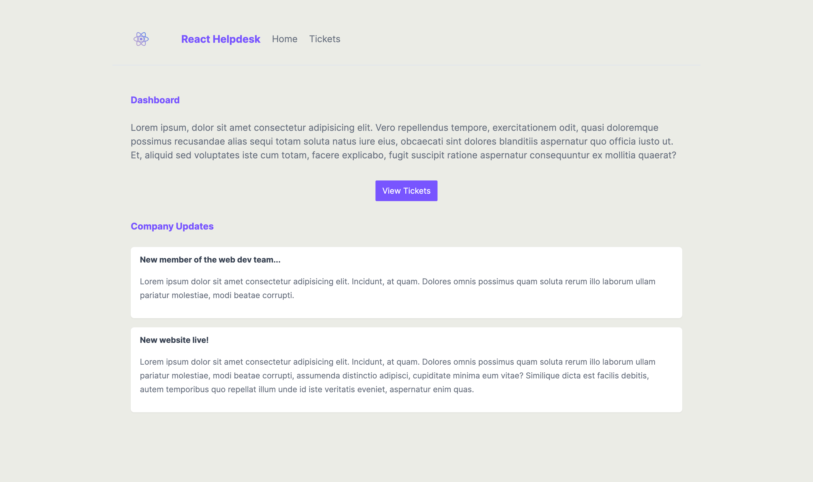
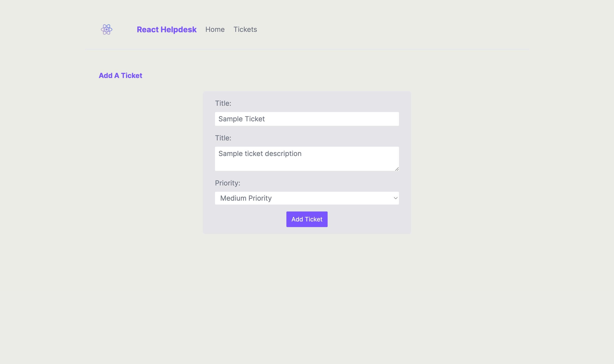
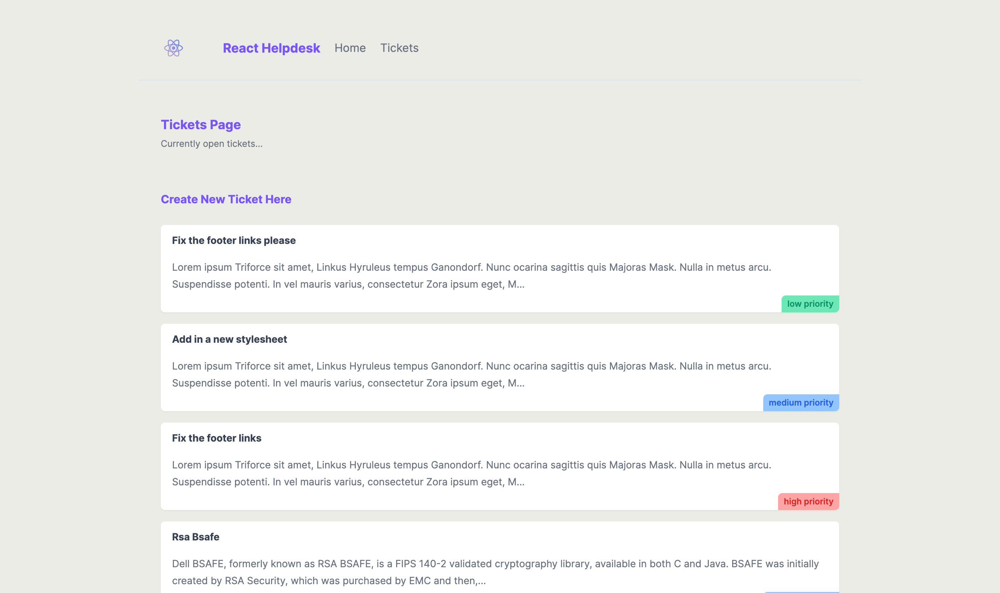

# Website to request assistance through tickets
---

### Author Links

👋 Hello there, I'm Joe Debrah

✅ [Check out my other Web Development portfolio's here on Github](https://github.com/JoeDebrah).

---
---

🚀 Check out my Linkedin below:

- [Github](https://github.com/JoeDebrah)
- [LinkedIn](https://www.linkedin.com/in/joe-debrah-953972264/)

---
## page demo
Home

ticket page

ticket view

---

### Description

🛠️ This is an interesting project i built with the help of the resources avilable of the Next.js website. It is a simple website to request assistance by creating tickets. You can also add a severity to your tickets. This was largely built with Next.js and styled with tailwind. 

---
---

🌅 [Check the preview_screenshots for a preview of the site](preview_screenshots) for this repository.

---
---

### You can run this app using 'npm run dev' in your terminal or edit the individual pages as well.
---
---
### 📚 Website References
- 🔗 [Next.js Official Website](https://nextjs.org/)